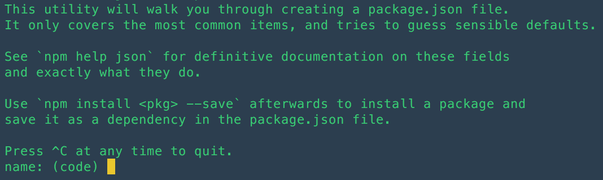
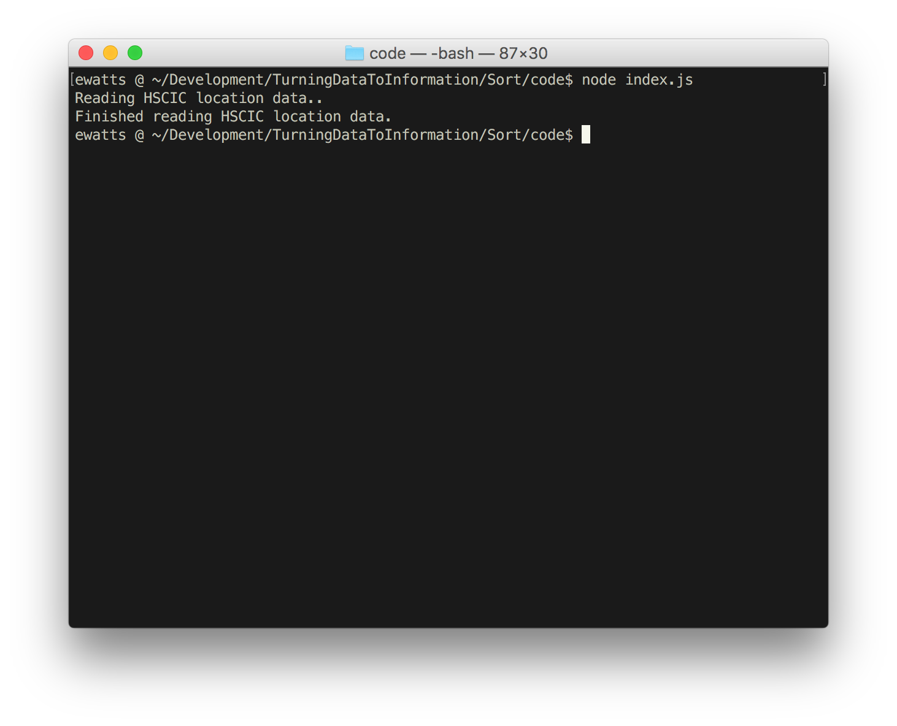
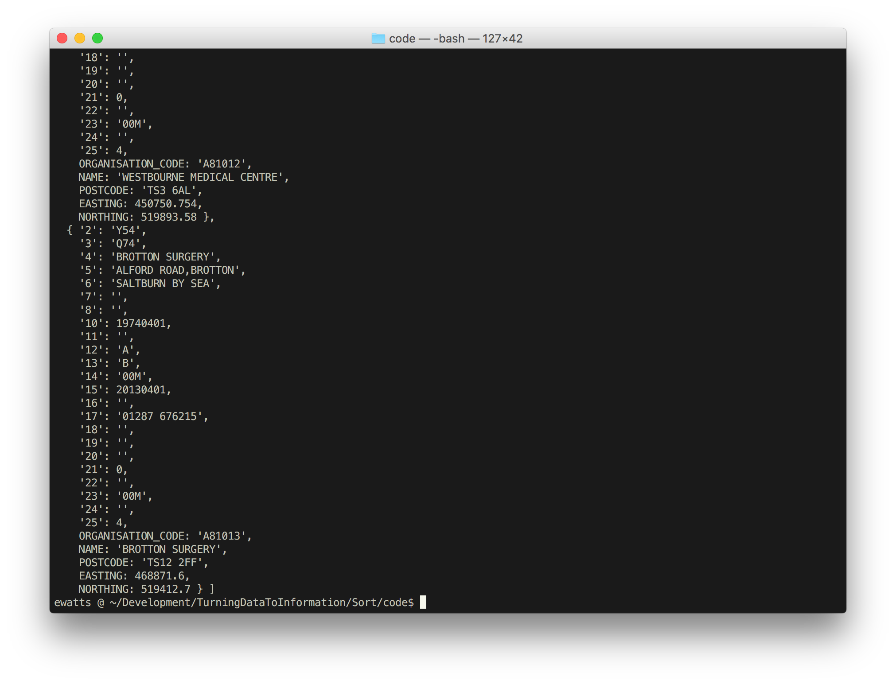

## Task 1 Data Processing

In this task we will take the original HSCIC data and match it against the OS Names API which will allow us to add the Easting and Northings to each GP practice, so that we can then plot it on the map. For this we are going to use NodeJS and some of its modules to allow us to read the datasets.

### Steps
1. Read the HSCIC GP location data (epraccur.csv) and turn the data into JSON
2. Loop through the JSON and use the postcode to query the OS Names API and return the Easting and Northings
3. Loop through the GP practice data (General Practice 2014 Practice Level.csv) and match against the now georeferenced GP location data using the unique ID.
4. Export and save the matched data to a CSV file.

#### Step 1
Firstly make sure you have NodeJS installed as explained in the workshop readme.

So now that we have NodeJS installed we can read the data. The data has already been downloaded and can be found in the data directory. So let's get coding.

When writing any NodeJS scripts you start by creating a package.json file which contains all the information about the script, (the author, the licence, what modules it uses etc). You can either hand write this or you can get Node Package Manager to do it for you.

[NPM is the package manager (Node Package Manager) for NodeJS and is installed at the same time as when you installed NodeJS. This allows you to easily install any other modules written by people. There are over 250,000 packages stored on https://www.npmjs.com/. We will use some of them shortly.]

Open your command prompt or terminal in the code folder and run the following

`npm init`

You should see the following



At the moment it using the folder name as the name for the package, which is not ideal, so type in a name, for example

`parse_hscic_data`

It will then ask a number of further questions

`version: (1.0.0)` - leave as is or maybe change to 0.0.1

`description:` - A script to parse HSCIC data and add Easting and Northing coordinates from Code-Point Open

`entry point:` - leave as index.js

`test command:` - leave blank

`git repository:` - leave blank

`keywords:` - leave blank

`author:` - your name

`licence:` - pick your choice of licence

It will then give you a summary of the details and ask you if that is ok? Hit ENTER

If you now look in the folder you will now see a package.json file which contains the details we have just entered and also an index.js file which will hold our code.

We know the HSCIC data is a CSV file so we need to read that data format. Luckily for us many people have already written code that reads this format and released their code as an NPM package. One of these packages is called 'csvtojson' (https://www.npmjs.com/package/csvtojson). To install this package we use NPM, so in your command prompt/terminal run the following:

`npm install csvtojson --save`

In our code directory you will now see a node_modules folder and inside there a csvtojson folder. This contains the code. If you look at the NPM page for csvtojson it runs through how to use the package and gives great code examples, one of which is the exact code we require.
```javascript
//Converter Class
const Converter = require("csvtojson").Converter;
var converter = new Converter({});

//end_parsed will be emitted once parsing finished
converter.on("end_parsed", function (jsonArray) {
console.log(jsonArray); //here is your result jsonarray
});

//read from file
require("fs").createReadStream("./file.csv").pipe(converter);
```

Open the index_start.js file found in the code directory in a text editor (eg Atom, Sublime Text, VIM, Notepad++, Visual Studio) and paste that code in.

We need to make just one amendment to this example code and point the read from file to our CSV.

```javascript
require("fs").createReadStream("../../../Data/Source/epraccur_sample.csv").pipe(converter);
```

Save the index_start.js file and we can now run the script by returning to the command prompt/terminal and running the following

`node index_start.js`

You should see very quickly that the json data we have just created is printed.

WELL DONE you have completed step 1.


#### Step 2
Before we write the code to use the locations with OS Names API we need to make a few changes to our existing index_start.js. These are just cosmetic changes but I think it will make the code easier to read as we add to it. So amend the code to the following:
```javascript
//Require packages and modules
const fs = require("fs");
const Converter = require("csvtojson").Converter;

//Converter Class
var converter = new Converter({});

//end_parsed will be emitted once parsing finished
converter.on("end_parsed", function (jsonArray) {
console.log(jsonArray); //here is your result jsonarray
});

//read from file
fs.createReadStream("../../../Data/Source/epraccur_sample.csv").pipe(converter);
```
What we have done here is create a global constant for 'fs' (This refers to File System and is in-built into the NodeJS API and is used for reading and writing files). As a result of now having the 'fs' constant we have changed the line that reads the CSV file to use the variable name. We have also moved the require("csvtojson") to the top as well. This just makes the code cleaner and easier to read.

Now, lets wrap some of that within a function - this will make more sense later, but essentially when we kick off the script we want to start a chain-reaction of events. Take a look at the code below as to how your script should look
```javascript
//Require packages and modules
const fs = require('fs');
const Converter = require('csvtojson').Converter;

function readPracticeLocation() {
  console.log('Reading HSCIC location data..');

  var converter = new Converter({});
  //end_parsed will be emitted once parsing finished
  converter.on('end_parsed', function(rawGpData) {
    console.log('Finished reading HSCIC location data.');
  });

  //read from file
  fs.createReadStream('../../../Data/Source/epraccur_sample.csv').pipe(converter);
}

//kick off the read function
readPracticeLocation();
```

Now when you run `node index_start.js` you should be greeted with the following in your terminal:


We now need to geocode this data - for this exercise we are going to use the [OS Names API](https://developer.os.uk/shop/places-networks/os-names-api.html?___store=apishop_storeview).

To do this we're going to create a function that uses the package async. So before we go any further, run `npm install --save async` in your terminal and add the following to your list of constants in `index_start.js`:
```javascript
const async = require('async');
```
Now add a global `locations` variable above your `readPracticeLocation` function - and copy the rawGpData data to it when it's finished parsing. We also need to add a call to a function to add the XY data (`addXY()`):
```javascript
//Global vars
//locations global to store gp location data
var locations;

function readPracticeLocation() {
  console.log('Reading HSCIC location data..');

  var converter = new Converter({});
  //end_parsed will be emitted once parsing finished
  converter.on('end_parsed', function(rawGpData) {
    console.log('Finished reading HSCIC location data.');
    locations = rawGpData;
    addXY();
  });

  //read from file
  fs.createReadStream('../../../Data/Source/epraccur_sample.csv').pipe(converter);
}
```

Right now the above will do very little other than give you an error telling us that `addXY is not defined`. We had better define it, add the below code to your file, outside of the `readPracticeLocation` function:
```javascript
function addXY() {
  console.log('Now geocoding HSCIC location data against OS Names API');
  async.mapLimit(locations, 10, requestXY, function(err, results) {
    console.log('Finished add XY to HSCIC location data');
    console.log(locations);
  });
}
```

What does this do 🤔? Let's break it down:
`async.mapLimit` is a collection method from [async](https://github.com/caolan/async#map) - this allows us to iterate over the array and get around NodeJS' non-blocking nature. This function will wait for all the data to be matched to the OS Names API before moving onto the next thing (at the moment logging messages and data to the console) and it takes the following arguments:

Param | Description
------------ | -------------
Collection (array) | Data you need to be processed
Limit (number)| Amount of times you want the iteratee called at any one time
Iteratee (function)| Function to be called to do stuff with data
Callback (function)| When everything is over, what next?

Now we will need to add our function that makes the requests to the OS Names API, as you can see above, it is very smartly called `requestXY`. We're going to use a library called `request-promise` to handle our requests and responses, so we need to install that to our project so back to terminal and `npm install --save request-promise`.

By now you're probably getting the hang of the flow, so now add
```javascript
const rp = require('request-promise');
```
Underneath your other constants. You'll notice that we've called this constant rp instead of request-promise. This is partly because we're lazy at typing (and you cant use dashes in variables/constants), but also to show that you can declare these packages as *almost* anything you want. Just try to make it sensible, and memorable.

So back to that function..
```javascript
function requestXY(gp, callback) {
  var options = {
    uri: 'https://api.ordnancesurvey.co.uk/opennames/v1/find?key=ENTER API KEY HERE',
    qs: {
      query: gp.POSTCODE
    },
    json: true
  };
  rp(options)
    .then(function(response) {
      //update location property
      gp.EASTING = response.results[0].GAZETTEER_ENTRY.GEOMETRY_X;
      gp.NORTHING = response.results[0].GAZETTEER_ENTRY.GEOMETRY_Y;
      callback(null, gp);
    })
    .catch(function(err) {
      console.log('There was an error, skipping ', gp.NAME)
      gp.EASTING = 0;
      gp.NORTHING = 0;
      callback(null, gp);
    });
}
```
`requestXY()` takes an `item` and a `callback` for arguments, item being the particular member of the array that our async function is iterating over, and callback to route back through and tell the async function that we're done.

We need to set out a few options for our request to the OS Names API - we do this with our `options` object. We use the following parameters:

Param | Description
------------ | -------------
uri (string) | Where we want our request to be made to
qs (object)| Here we put parameters for our querystring. In this instance OS Names API expects `query` as part of the query string. We could also put key in here, but the key we are using will not change among calls so that isn't so important here.
json (boolean)| `true` if you expect a JSON response.

We then make the request by calling `rp` along with our options. You may have guessed but `request-promise` uses promises, in this instance it uses a promise library called [bluebird](https://github.com/petkaantonov/bluebird) to provide a `.then(..)` method on our request. Placing the next parts of our code inside the `.then(..)` method, we can be sure that we have received a repsonse from the server.

Once we have a response, we simply create two new keys within our `gp` object, `EASTING` and `NORTHING` using the first hit from the API response. We then use the callback to return up the stack.

Now when you run `node index_start.js` you'll see a whole bunch of JSON data print to the console:


Notice how its added `EASTING` and `NORTHING` to the JSON data? You've just gone done a geocode.
***REMOVED***

Onward to step three!!

#### Step 3
So, now we know where our General Practice surgeries are, it would be nice to know a little bit more about them, right? Enter the snappy sounding `General Practice 2014 Practice Level.csv`! (you'll find it in ../Data/Source). It has loads of information about Patient Numbers, GPs, Dispensing information and more. We're going to need to match this data to our location information as it's not shipped together.

We need to make a little tweak to our `addXY()` function we made in Step 2. Instead of logging our results to the console, we want to kick off a new function.
```javascript
function addXY() {
  console.log('Now geocoding HSCIC location data against OS Names API');
  async.mapLimit(locations, 10, requestXY, function(err, results) {
    console.log('Finished add XY to HSCIC location data');
    readPracticeInfo();
  });
}
```

With that out of the way, we of course need to go and create that function:
```javascript
function readPracticeInfo() {
  console.log('Reading HSCIC Practice Info data...');
  var converter = new Converter({});
  //end_parsed will be emitted once parsing finished
  converter.on('end_parsed', function(info) {
    console.log('Finished reading HSCIC Practice Info data.');
    matchData(info);
  });
  fs.createReadStream('../../../Data/Source/General Practice 2014 Practice Level.csv').pipe(converter);
}
```

This is very *very* similar to our initial `readPracticeLocation()` function, so we won't dwell too much on what this is doing - but lets just take note that once the data has finished parsing, we need to go to another function called `matchData()` and we're parsing `info` to it, which is the JSON data that has just been parsed from CSV.

Before looking below, go ahead and run `npm install json2csv --save` - we need to convert our JSON data back to CSV once matched, and this package allows us to do that easily. Underneath your other `const` declarations pop in
```javascript
const json2csv = require('json2csv');
```
and move on below.
```javascript
///PUT THIS UNDERNEATH var locations///
//gps array to store matched data.
var gps = [];

///THIS GOES BELOW readPracticeInfo()///
function matchData(info) {
  console.log('Matching Practice and Location Data.');
  async.forEachOf(info, function(value, key, callback) {
    for (var i = 0; i < locations.length; i++) {
      if (value.PRAC_CODE !== locations[i].ORGANISATION_CODE) {
        /*do nothing*/
      } else {
        var surgery = {
          ORGANISATION_CODE: locations[i].ORGANISATION_CODE,
          SURGERY_NAME: locations[i].NAME,
          SURGERY_POSTCODE: locations[i].POSTCODE,
          TOTAL_PATIENTS: value.TOTAL_PATIENTS,
          TOTAL_DOCTORS: value.TOTAL_GP_HC,
          RATIO : (value.TOTAL_PATIENTS / value.TOTAL_GP_HC),
          EASTING : locations[i].EASTING,
          NORTHING : locations[i].NORTHING
        };
        gps.push(surgery);
      }
    }
    async.setImmediate(function() {
      callback();
    });
  }, function(err) {
    if (err) {console.error(err.message);}
    console.log('Successfully matched data... Now writing to gp_data.csv.');
    json2csv({data: gps}, function(err, csv) {
      if (err) console.log(err);
      fs.writeFile('gp_data.csv', csv, (err) => {
        if (err) {throw err;}
        console.log('CSV file written, ready to use!!');
      });
    });
  });
}
```

This one is definitely new territory, so lets break it down!
We initially create a new array in the global scope. This will hold our final matched data that gets written out to file.

For this task we use the `forEachOf` method of the `async` library. It takes very similar arguments to the `mapLimit` method, except we don't use a `limit`, we just pass it an array to iterate over, and a function that is to be applied to each item within the array.
Then here is where things get a little interesting. We need to match items across two arrays - so we use a good old fashioned `for` loop to loop over our locations array, and if the items do not match between our information (`info`) `PRAC_CODE` key and our `locations` `ORGANISATION_CODE` key, we do nothing, if they match, we do some maths to create a `RATIO` key and attach our Eastings and Northings from our `locations` data and push the item into our `gps` array.

You'll notice we initiate our callback within an `async.setImmediate` method. This is because where we are handling thousands of rows vs thousands of rows, we very quickly risk getting ourselves into a `Maximum call stack size exceeded.` situation. We don't want this, so the `setImmediate` method allows us to defer our callback.

Once the data is matched we go on convert it back to CSV data with `json2csv`, then we just write out the data with `fs`'s `writeFile` method.

# TASK ONE COMPLETE
***REMOVED***
