## Visualise the data in QGIS

This task will walk you through how to open the HSCIC processed data in QGIS and visualise it.

### Steps
1. Open the CSV data in QGIS
2. Add base map using OS Maps API
3. Style and visualise the data

#### Step 1
Launch QGIS and make sure the project CRS is EPSG:27700. You can check this by looking in the bottom right hand corner of the QGIS window.

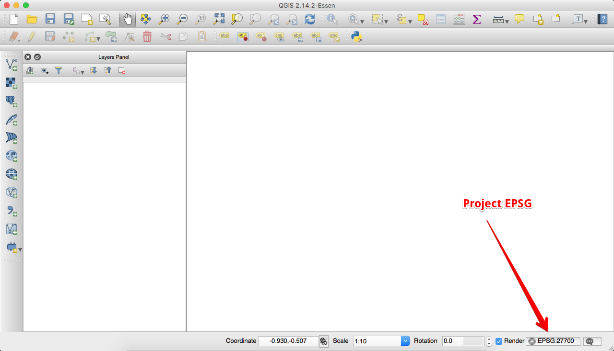

If it isn't then go to the Project Properties from the top menu and change the selected CRS.

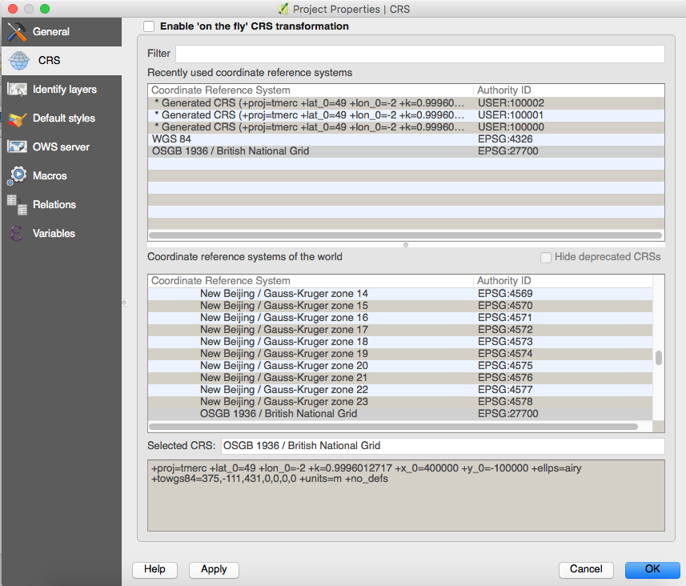

Once done, let us add our data.

Find the 'Add Delimited Text Layer' button from the toolbar. It looks like this:

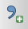

And a new dialogue window opens.

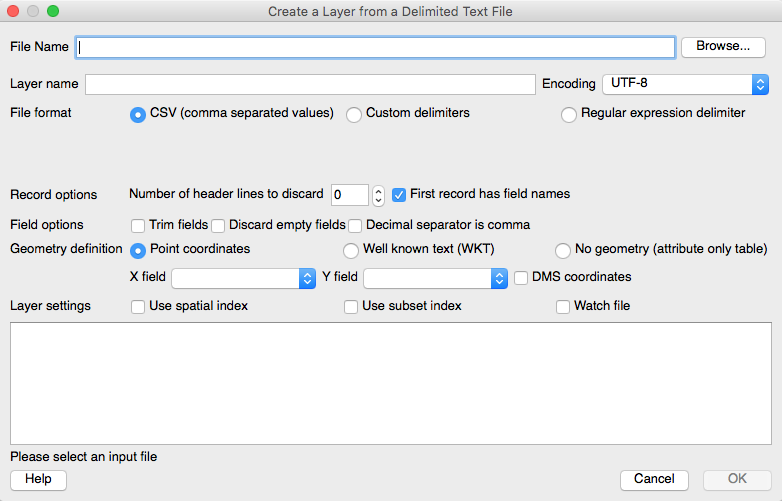

We can use the 'Browse' button to open the data our NodeJS code just exported.

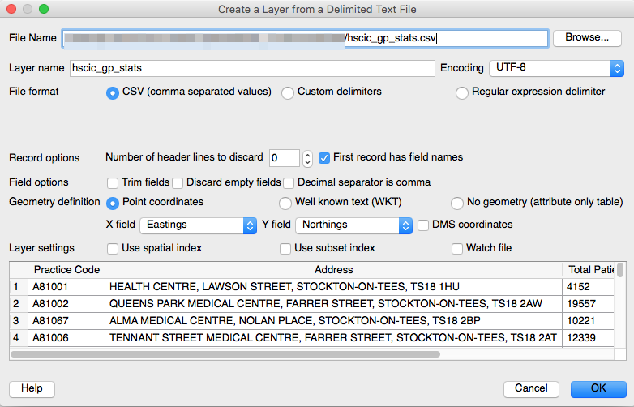

You can see that QGIS has parsed the data with its best efforts. Some times though we need to tweak the settings, such as what delimiter the file has, does it have a header line, which columns contain the coordinates we want to use.

So use the options until they match the above image.

Now hit 'Ok'

A Coordinate Reference System Selector box may appear, make sure you select EPSG:27700 (British National Grid) as we have Eastings and Northings from the OS Names API.

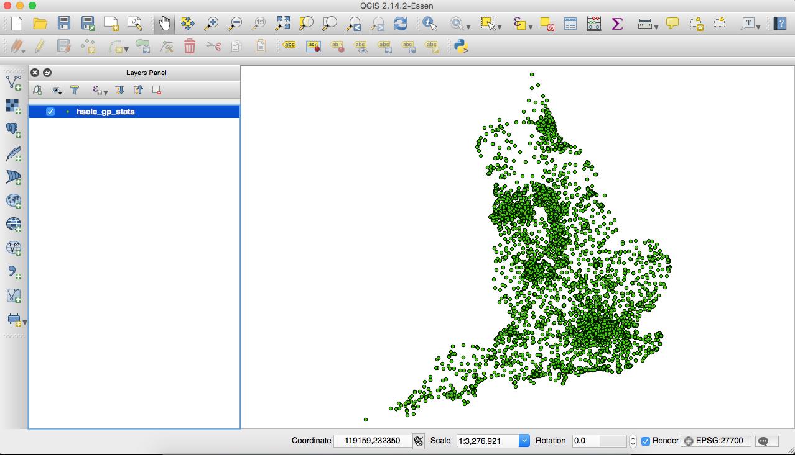

Hopefully you should see the above image showing the GP locations around the country.

#### Step 2

To give the GP locations some context we should add a base map. This could come from a number of different places, either local raster data, or local vector data such as OS OpenMap Local, or we could use a Web Map Service/Web Map Tile Service.

We will use the latter of these and connect to an OSM Tile Service using a QGIS Plugin.

Click Plugins > Manage and Install Plugins. Search for 'quickmapservices' and click install. Once installed Click Web > QuickMapServices > OSM > OSM Mapnik

You've added a basemap! :)

You may need to shuffle the layer order in the QGIS Layers Panel, so that the GP locations is listed first in the order.

#### Step 3 Style the data

At present our data does not mean much so let us change that by styling the points based in the 'Ratio' attribute we added in Task 1.

Double click the GP Locations layer in the QGIS Layers Panel (or right hand mouse click the layer and choose 'Properties') and the Properties dialogue window appears.

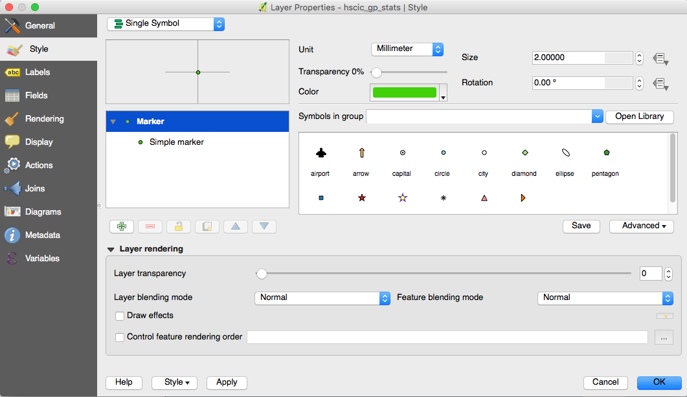

At present the layer is being styled with a 'Single Symbol', we can use the in built styling options within QGIS to improve the styling.

So first use the drop down list to pick 'Graduated'.

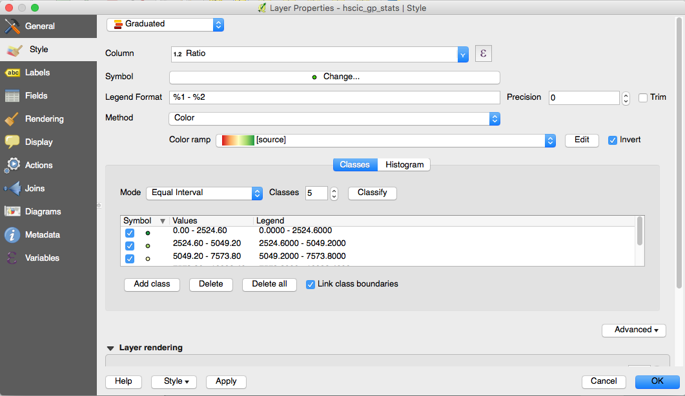

Then set the following:

Column: Ratio
Color ramp: pick the red to green but click the Invert button
Then click the Classify button and the box should be populated with the ratio classes based in the mode. In this instance 'Equal Interval'.

Click 'Ok' and you should now see the following.

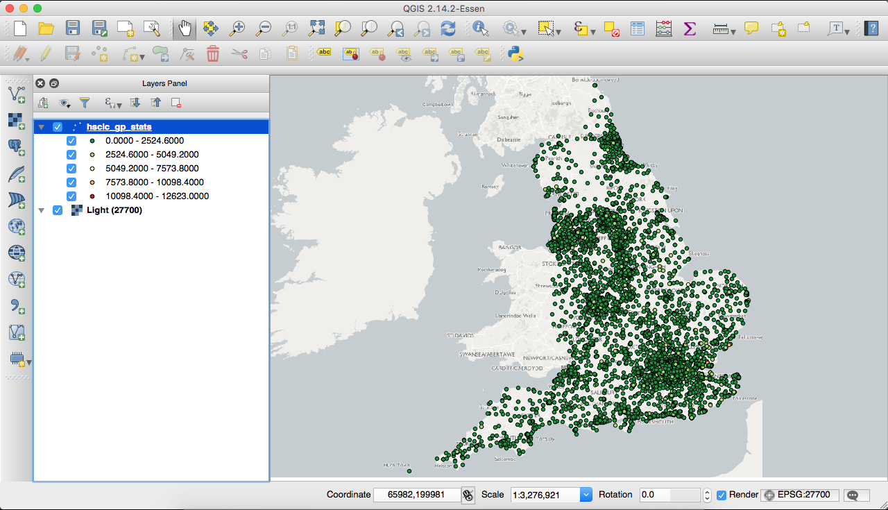

Have a play around with the different 'Graduated' 'Modes' and see what the impact is on the visualisation of the data.

Wouldn't it be awesome if we could change the size of the markers based on the number of patients.

Well in QGIS we can!!

Go back to the layer properties and where it says 'Symbol' click the 'Change' button. A new dialogue window will appear that looks like this.

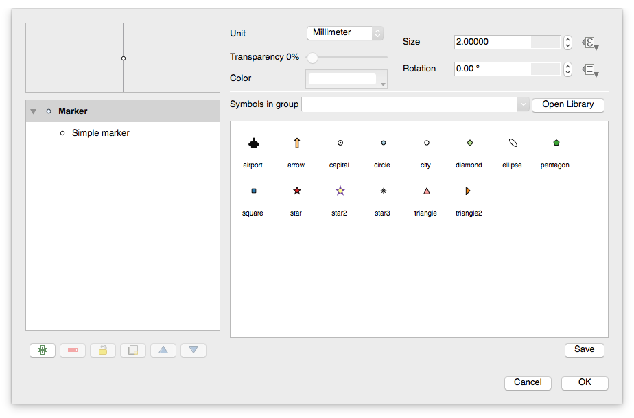

Click the 'Expression' button next the the Size option, it looks like this:

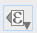

And select the 'Size Assistant' option

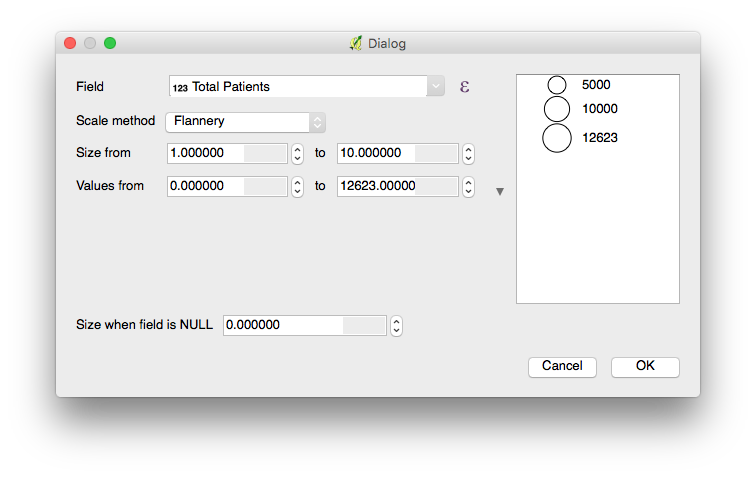

Set the field to Total Patients and and the Size from 1.0 to 5.0 and then click 'Ok'

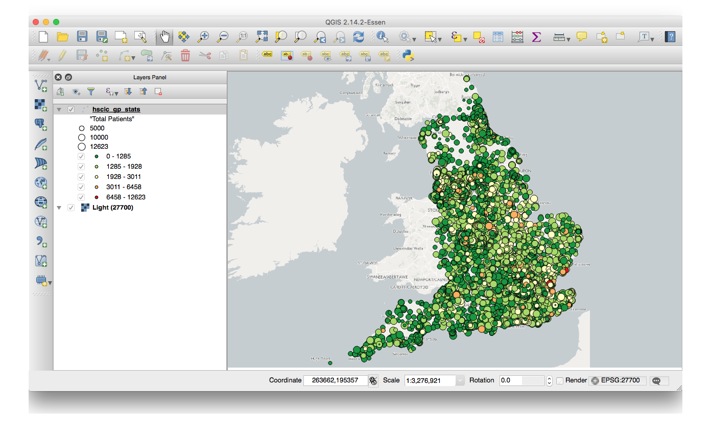

I modified the layer further by removing the symbol outer lines and then have changed the 'Layer Rendering' and applied a control over the rendering order using the Ratio ASC NULLS LAST.

This is the final map:

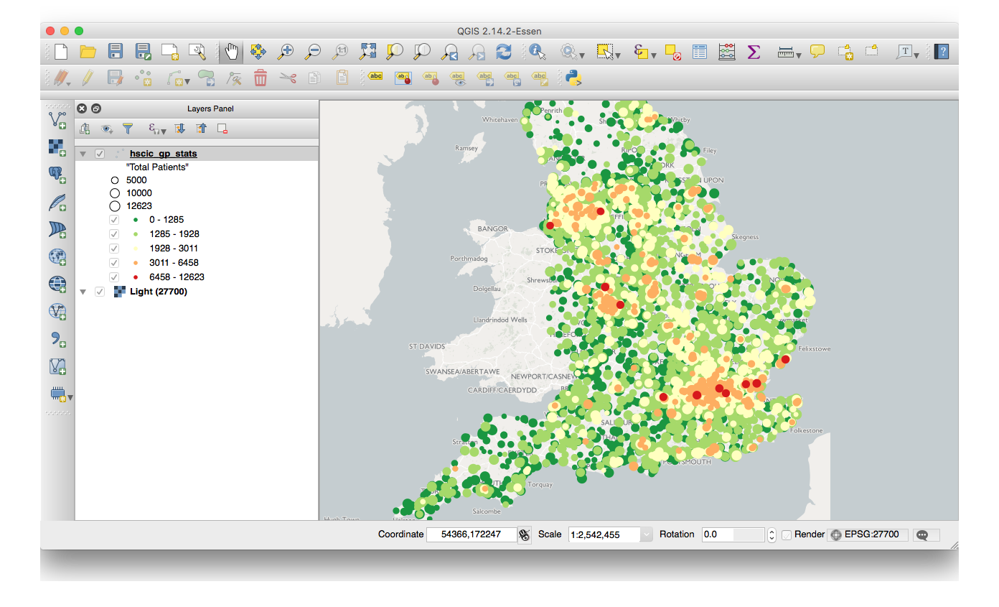

I think this shows how quickly you can start to visualise the data and how tweaking some of the rendering options can produce an information graphic.
