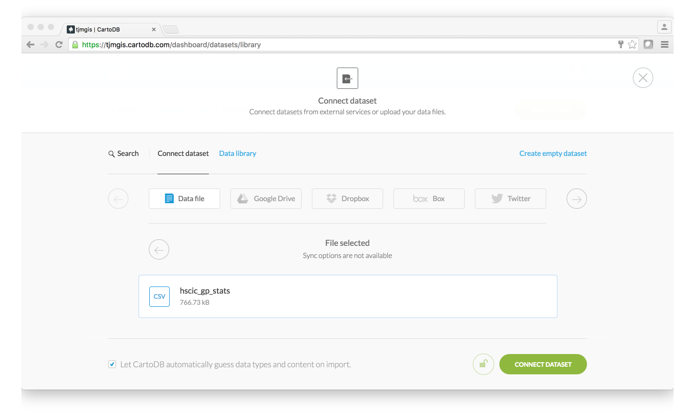
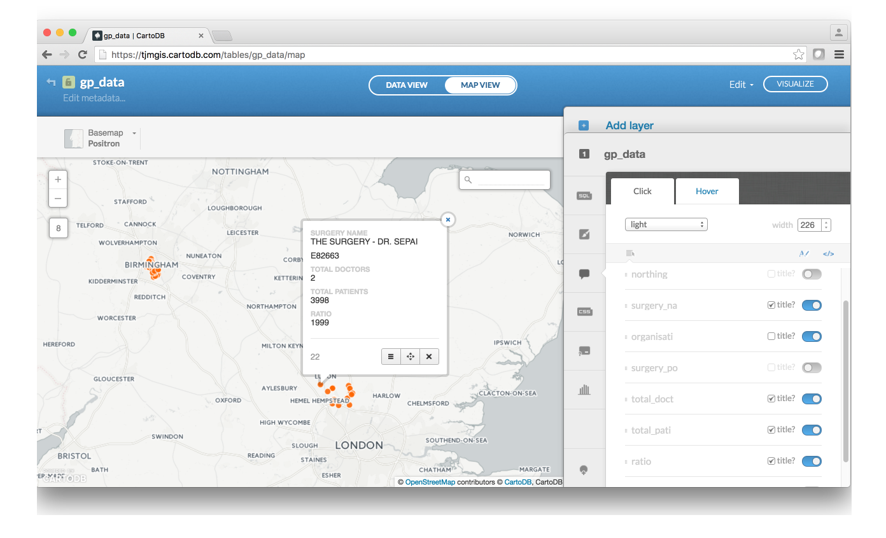

## Create a web map application

This task will walk you through how to use the HSCIC data in CartoDB and create your first web map application

### Steps
1. Upload the HSCIC data to your CartoDB account
2. Query the data using SQL
3. Map the data
4. Create a visualisation
5. Share your map

#### Step 1

We can get the data into CartoDB in several different ways, the first being to following routine:

Let us begin by logging into your CartoDB account, so open a browser window and go to the following URL.

`https://cartodb.com/`


And clicked Login in the top right hand corner.


Login using your account details that you set when you opened up your account.

You will then login and see your CartoDB dashboard. Your landing dashboard may be different to the image below as I have no maps or datasets currently in my account.


In the blue header next to my username, use the drop down icon to swap from Maps to Datasets.


Click the green 'New Dataset' button.


You can now either Drag n Drop a CSV file or a zipped ESRI Shapefile



And the click 'Connect Dataset' and you should see a small dialogue box in the bottom left hand side of the browser window showing the upload progress.


Once uploaded the dashboard should refresh and you should see your data.


Or the other method is to use the CartoDB QGIS plugin to upload the data directly from QGIS to our CartoDB account.

So in QGIS, click Plugins>Manage and Install Plugins


Then either scroll down the list of search for CartoDB.


Enable it by selecting the box next to the plugin name.

This will add the CartoDB plugin to our toolbar.


Click the Add Connection part of the toolbar, then 'New' so that we can connect to our existing CartoDB account.

Fill in the details of your CartoDB username and the API key, which can be found in your CartoDB dashboard under 'Your API Keys'.

Once done you should see a connection listed.


Click 'Connect'

Then to upload your data, just click the 'Upload' icon on the CartoDB toolbar.


And then click 'Upload'

It tells you the progress and when it has completed.


If you log into your CartoDB account you will see your data is now listed under your Datasets.


We can now explore the data in Step 2.

#### Step 2

The CartoDB platform is built on top of the open source relational database PostgreSQL and CartoDB give us the option of being able to query the data using SQL just like you would if the data was stored in your own database.

On the right hand side click the SQL button which looks like this:


And the SQL pane will appear.


This pane is where you can write SQL queries. At present the SQL is

`SELECT * FROM hscic_gp_stats`

This is basically saying 'Select All Attributes and Rows of Data from the table hscic_gp_stats'

This workshop does not cover SQL in great detail, however, let's write some different SQL queries to get a feel for what we can do with CartoDB.

Run the following SQL queries.

`SELECT address, number_of_gps, total_patients, ratio FROM hscic_gp_stats`


You can see the data table has changed and we now only get the attributes we requested.

`SELECT address, number_of_gps, total_patients, ratio FROM hscic_gp_stats WHERE ratio > 4000`


This returns only the GPs that have a ratio of greater than 4000.

Not only is CartoDB built on PostgreSQL, it also has the spatial extentions PostGIS. PostGIS is a spatial database extender for PostgreSQL, which allows us to store spatial data (which we have already done when we uploaded the HSCIC data) and also to query the data using spatial functions.

So one great one is to find the nearest GP Surgeries to your location.

The SQL looks like this:

```
SELECT *
FROM gp_data
ORDER BY gp_data.the_geom <-> ST_SetSRID(ST_MakePoint(-1.44, 50.909), 4326)
LIMIT 5
```

This uses the NEAREST PostGIS operator <-> and a Latitude/Longitude point for Southampton.


So that is the end of querying the data using SQL, we will now create a visualisation similar to what we created in QGIS.

#### Step 3

On the dashboard click the 'Map View' and you should see a map with the points over it.


HOW SIMPLE WAS THAT!

#### Step 4

Now we have dots on the map, we can use the visualisation tools within CartoDB to turn this data into information.

Let's start by adding some info windows, so then when a user clicks on a GP location a box will appear showing the attribute details.

On the right hand side there is a vertical column of icons, one of which looks like a speech bubble. Click that icon and the right panel will open to display the following:

 

 Here you can select the style of the infowindow using the top drop down list, leave as light for the time being but you could change yours if desired.

 Then using the switches turn on the attributes you want to be visible in the infowindow. Turn on the following:

- surgery_na
- organisati
- total_doct
- total_pati
- ratio

You can drag each row to reorder the list to match the list above.

You will also notice that the field names are taken from the database table field names which have been truncated. We can change that by click the Font icon underneath the width bar at the top of the dialogue. The panel changes and will now allow you to change the title names of the fields.

Your end result should be this:

 

 Brilliant we now have informative info windows, now we will style the points.

 So click the paint brush icon, labelled wizards, and do the following:

 - Type = choropleth
 - Column = ratio
 - Buckets = 5 Buckets
 - Quanitification = Jenks
 - Color Ramp - I have picked the ramp that goes from green to red
 - Marker Width = 12

  

  CartoDB not only has wizards to help style your data it also gives us the ability to customise it using CartoCSS. This is extremely useful when you want to tweak the styles, like for examples make the markers larger for GPs that have larger ratios.

  So click the 'CSS' icon on the panel and you should see some CartoCSS styling already there, these are generated when we used the wizard earlier.

  

  So change the marker size we need to add `marker-width` to the rules. So edit the CartoCSS until you have the following:

  ```
  #gp_data{
  marker-fill-opacity: 1;
  marker-line-color: #FFF;
  marker-line-width: 1;
  marker-line-opacity: 1;
  marker-fill: #1a9850;
  marker-allow-overlap: true;
}
#gp_data [ ratio <= 4767] {
   marker-fill: #d73027;
  	marker-width: 20;
}
#gp_data [ ratio <= 3078] {
   marker-fill: #f79272;
  marker-width: 18;
}
#gp_data [ ratio <= 2072.5] {
   marker-fill: #fff2cc;
  marker-width: 16;
}
#gp_data [ ratio <= 1945] {
   marker-fill: #8cce8a;
  marker-width: 14;
}
#gp_data [ ratio <= 1248.66666666667] {
   marker-fill: #1a9850;
  marker-width: 12;
}
  ```

And the results should look like this:


Excellent, well done.

#### Step 5

Now that we have created our map view it would be share this with others and CartoDB offers several different ways. To do this, click the 'Visulize' button in the top right hand corner. If this is your first time it may ask you to create your map. Essentially we have been composing the map, this then finalises it.


So click 'OK, CREATE MAP'

The dashboard will change and you will now see a 'Publish' option in the top right hand corner. Click it.


We now have three options

1. Get the link - this is a link to your map hosted by CartoDB. Great for emailing, Twittering etc
2. Embed It - if you have a website and want to include your map in your page you could use this option.
3. CartoDB.js - if you are building your own map application then you can use this option to pull in your visualisation. 

It is that easy!
