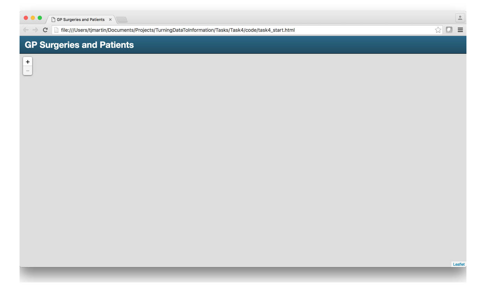
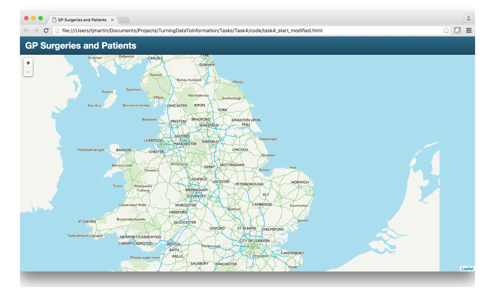
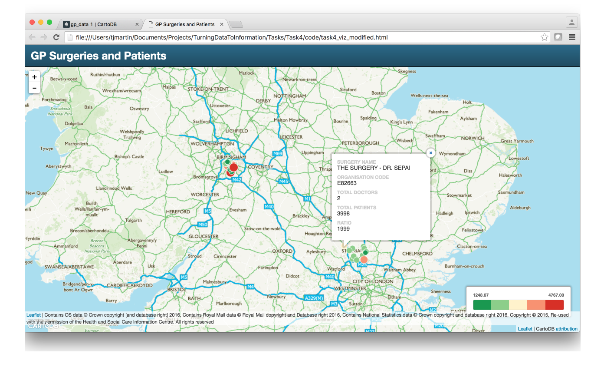
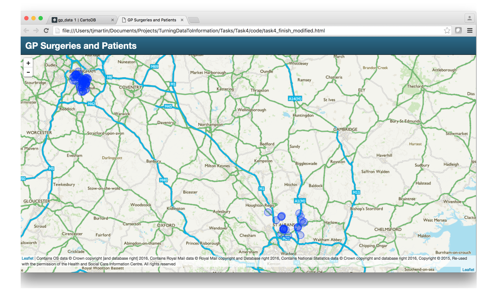

## Create a web map application

This task will walk you through how to use the HSCIC data from CartoDB in your own HTML web map application

### Steps
1. Show map template
2. Pull in the CartoDB viz.json
3. Change to use the CartoDB SQL API and pull in GeoJSON into our HTML page

#### Step 1

So to begin open the folder Task 4/code and in there you should see several HTML files. Double click the task4_start.html to open the HTML page in your default web browser and you should see the following.



This template is a modified version of a Bootstrap CartoDB template designed and open source by Chris Whong, who used to work at CartoDB. You should check out his GitHub as he has a number of awesome [repos](https://github.com/chriswhong).

At present it does not show much, so let us change that by opening the same HTML page in our text editor.

Scroll to the bottom until you find the following code line

```
L.tileLayer('https://api2.ordnancesurvey.co.uk/mapping_api/v1/service/zxy/EPSG%3A3857/Outdoor3857/{z}/{x}/{y}.png?key=ENTER API KEY HERE', {
```
Use the OS Maps API key supplied earlier in the workshop here to add the base maps to our application.

Once done refresh the application in your web browser.



Now we can pull in the CartoDB visualisation we created in the previous task.

#### Step 2

In the previous task when we went to share the map we created there were three options, one of which was to use CartoDB.js. Copy the link, it should look like

`https://tjmgis.cartodb.com/api/v2/viz/e44dfeea-2c7f-11e6-bbef-0e787de82d45/viz.json`

We can use this to add the visualisation to our application.

CartoDB has a great set of [documentation](https://docs.cartodb.com/cartodb-platform/cartodb-js/getting-started/) which shows us how to add a CartoDB Layer to an existing map.

```javascript
cartodb.createLayer(map, 'http://documentation.cartodb.com/api/v2/viz/2b13c956-e7c1-11e2-806b-5404a6a683d5/viz.json')
    .addTo(map)
    .on('done', function(layer) {
      //do stuff
    })
    .on('error', function(err) {
      alert("some error occurred: " + err);
    });
```

So using this add the following code to the HTML and modify it to your link.

```javascript
////////////////////////////////////////////////////////////////////////////////////////////
/////////////////////////////// Visualisation //////////////////////////////////////////////

cartodb.createLayer(map, 'YOUR viz.json LINK GOES HERE')
.addTo(map)
.on('done', function(layer) {
  //do stuff
})
.on('error', function(err) {
  alert("error occurred: " + err);
});
```

We also need to add our data attribution with the following code:

```javascript
////////////////////////////////////////////////////////////////////////////////////////////
/////////////////////////////// Attribution ////////////////////////////////////////////////

var credits = L.control.attribution().addTo(map);
credits.addAttribution("Contains OS data © Crown copyright [and database right] 2016, Contains Royal Mail data © Royal Mail copyright and Database right 2016, Contains National Statistics data © Crown copyright and database right 2016, Copyright © 2015, Re-used with the permission of the Health and Social Care Information Centre. All rights reserved");

```

Add that to the HTML page and then save and refresh the page in the browser.



As you can see we have the exact visualisation we had inside CartoDB now in our own application.

However, what if you want a more complex application. Maybe one that gives the user greater flexibility to query the data or use the data in the browser for different things. Well using the viz.json does not allow for this. But the CartoDB guys have made this easy for us. They have an SQL API which allows us to query and pull in the data as GeoJSON.

#### Step 3

So to use the SQL API we need to remove the code we added to pull in the viz.json and then refer back to the [documentation](https://docs.cartodb.com/cartodb-platform/cartodb-js/sql/).

It gives the following example:

```javascript
var sql = new cartodb.SQL({ user: 'cartodb_user' });
sql.execute("SELECT * FROM table_name WHERE id > {{id}}", { id: 3 })
  .done(function(data) {
    console.log(data.rows);
  })
  .error(function(errors) {
    // errors contains a list of errors
    console.log("errors:" + errors);
  })
```

This is a great starting point but the data is only outputted to the console, we require the data to become a Leaflet GeoJSON layer. The following code will do it. First add the following code to our HTML page.

```javascript
////////////////////////////////////////////////////////////////////////////////////////////
/////////////////////////////// Overlays //////////////////////////////////////////////

var gpLocations = L.geoJson(null, {
  pointToLayer: function (feature, latlng) {
    return L.circleMarker(latlng);
  }
}).addTo(map);
```

This creates an empty GeoJSON layer called gpLocations that has a circleMarker.

Next we need to query CartoDB using the SQL API and then push the data to this layer.

```javascript
var sql = new cartodb.SQL({ user: 'ENTER CartoDB USERNAME HERE', format: 'geojson' });

sql.execute("select * from TABLE_NAME")
  .done(function(geojson) {
      gpLocations.addData(geojson);
  });
```

We need to modify the above to our CartoDB username and also the tablename of our GP data.

Once the SQL has done executing it adds the GeoJSON response from CartoDB to our gpLocations layer.

Save your HTML and refresh it in the browser.



We now have GeoJSON points with the default circle marker in our application. This now offers us lots of possibilities, some of which are explored in the next few tasks.
