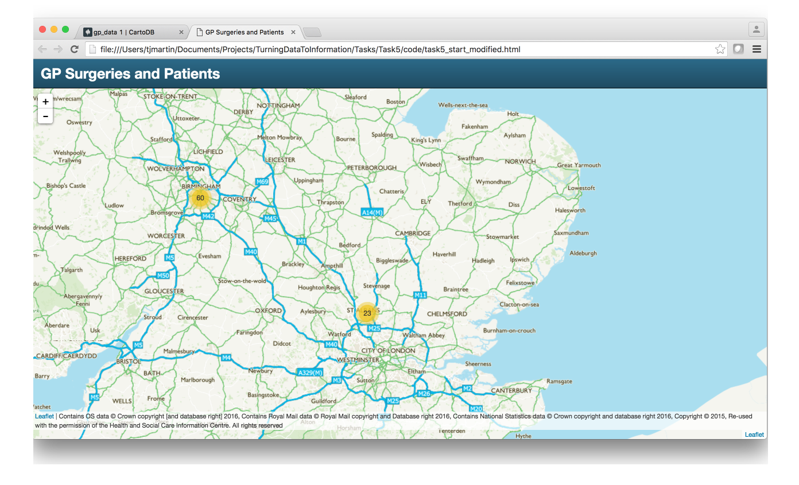
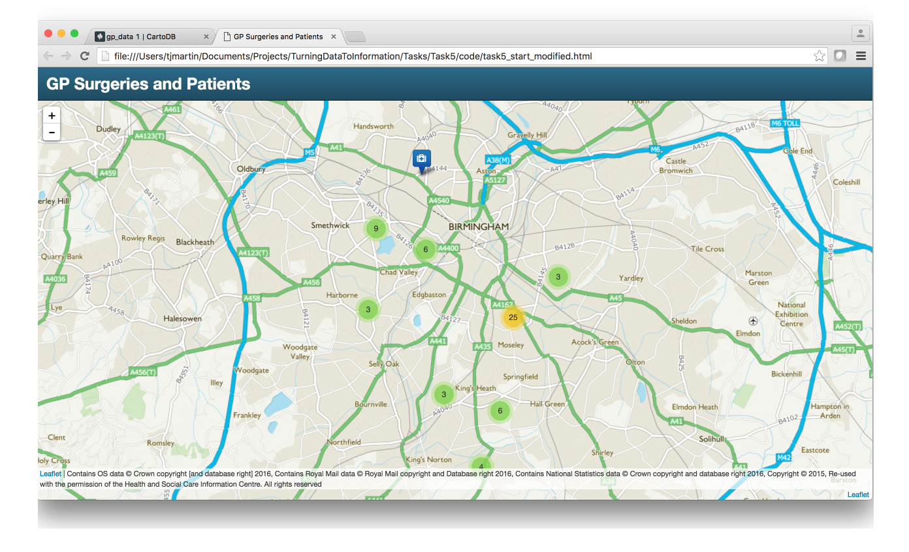
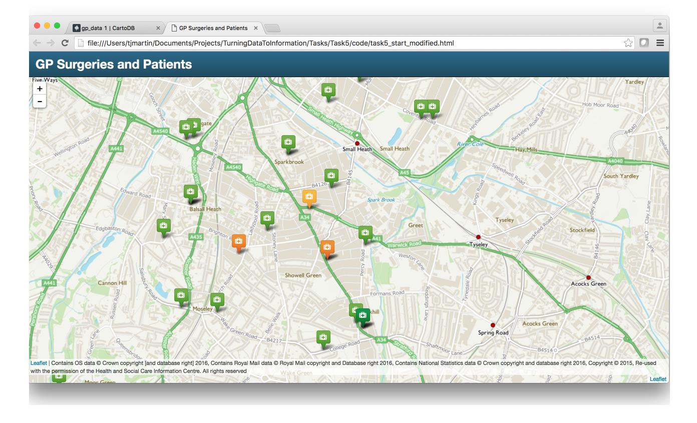
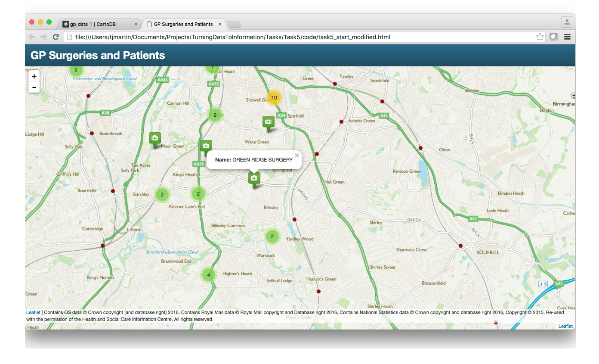

## Use Leaflet Plugins in our application

This task will introduce you to the Leaflet plugins and use some of them in our application

### Steps
1. Show the Leaflet plugin page and highlight some of the best
2. Add Marker Cluster plugin to our application
3. Style the markers
4. Filter the markers so we can style based on data attributes
5. Add pop up info windows

#### Step 1

Leaflet is designed to only have the core functions a javascript mapping library should have whilst all the extra functionality is done in extra Plugins, which users can pick and choose to use. There are a larger number of plugins these days and they can be found [here](http://leafletjs.com/plugins.html) built by the community.

In this task we are going to implement a number of the plugins to enhance our application.

#### Step 2

The first plugin we are going to implement is the [Marker Cluster](https://github.com/Leaflet/Leaflet.markercluster) plugin written by Dave Leaver. This will improve the performance of our application by allowing us to add all the GP locations into the application but cluster them to reduce the amount of markers on the map at any one time.

In Task 5/code you will see a task5_start.html and the MarkerCluster.Default.css to get you started.

Open the HTML in a text editor.

We need to start by adding a link to the MarkerCluster.css stylesheet. So in the header part of the HTML page find

`<link rel="stylesheet" href="https://maxcdn.bootstrapcdn.com/bootstrap/3.3.4/css/bootstrap.min.css">`

Straight below that copy in the following:

`<link rel="stylesheet" href="MarkerCluster.Default.css">`

We also need to add the javascrit library so scroll down until you see this line:

`<script src="https://maxcdn.bootstrapcdn.com/bootstrap/3.3.4/js/bootstrap.min.js"></script>`

Straight below that copy in the following:

`<script src="leaflet.markercluster.js"></script>`

Next we need to create a new MarkerClusterGroup so scroll down the code until you find where we create the gpLocations GeoJSON layer and add the following code above it.

```javascript
////////////////////////////////////////////////////////////////////////////////////////////
/////////////////////////////// Layers //////////////////////////////////////////////////

var markers = L.markerClusterGroup({
  spiderfyOnMaxZoom: false,
  showCoverageOnHover: false,
  zoomToBoundsOnClick: false,
  disableClusteringAtZoom:14
});

var gpLocations = L.geoJson(null, {
  pointToLayer: function (feature, latlng) {
    return L.circleMarker(latlng);
  }
});
```

This creates our group with some additional options, the full list of options can be seen in the MarkerCluster documentation page.

You will recognise the gpLocations layer code but we have removed the addTo map line as we no longer want to add that layer to the map we want to add the markers group to the map.

We now need to get the gpLocations data into our markers group. We can do this in our SQL query. So replace the original SQL code with the following:

```javascript
sql.execute("select * from gp_data")
  .done(function(geojson) {
      gpLocations.addData(geojson);
      markers.addLayer(gpLocations);
      markers.addTo(map);
  });
```

If you compare the two code blocks you can see we still add the GeoJSON response to the gpLocations but we now additionally add gpLocations to the markers group and then we add the markers group to the map.

Open the HTML page in the browser and you should see the following:



Clustered Markers Simples!

#### Step 3

So we now have clustered markers but we have the very boring blue circle markers so next we will change those by using a different plugin. For this we will use the [ExtraMarkers plugin](https://github.com/coryasilva/Leaflet.ExtraMarkers).

Use the same routine as above to add the ExtraMarkers css and js files to our HTML.

Next we need to define a new marker style. Copy and paste in the following code above 'Layers' section in the code.

```javascript
////////////////////////////////////////////////////////////////////////////////////////////
/////////////////////////////// Styles /////////////////////////////////////////////////////

  var defaultMarker = L.ExtraMarkers.icon({
    icon: 'fa-medkit',
    markerColor: 'blue',
    shape: 'square',
    prefix: 'fa'
  });
```

This defines a new defaultMarker and uses the medkit icon from the awesome [Font Awesome](http://fontawesome.io/) icon set. You could change the settings by looking at the documentation.

With the defaultMarker configured we now need to get the gpLocations GeoJSON layer to use it. So we need to modify that code to the following:

```javascript
var gpLocations = L.geoJson(null, {
  pointToLayer: function (feature, latlng) {
    return L.marker(latlng, {icon: defaultMarker});
  }
});
```

If you compare the code we now define the icon rather than using Leaflet's default circleMarker.

Open the HTML page in the browser and you should see the following:



As you can see we now have a blue marker (you may need to zoom in until you see a single marker)

#### Step 4

In order to recreate the visualisation we created in QGIS and the CartoDB dashbaord we need to style the markers based on the 'Ratio' attribute. To achieve this we need to do a number of things

1. Add several different marker styles using the Extra Marker plugin
2. Add a filter so that a marker is applied based on the ratio.

Start by replace our defaultMarker style with the following:

```javascript
////////////////////////////////////////////////////////////////////////////////////////////
/////////////////////////////// Styles /////////////////////////////////////////////////////

  var range1Marker = L.ExtraMarkers.icon({
    icon: 'fa-medkit',
    markerColor: 'green-light',
    shape: 'square',
    prefix: 'fa'
  });

  var range2Marker = L.ExtraMarkers.icon({
    icon: 'fa-medkit',
    markerColor: 'green',
    shape: 'square',
    prefix: 'fa'
  });

  var range3Marker = L.ExtraMarkers.icon({
    icon: 'fa-medkit',
    markerColor: 'yellow',
    shape: 'square',
    prefix: 'fa'
  });

  var range4Marker = L.ExtraMarkers.icon({
    icon: 'fa-medkit',
    markerColor: 'orange',
    shape: 'square',
    prefix: 'fa'
  });

  var range5Marker = L.ExtraMarkers.icon({
    icon: 'fa-medkit',
    markerColor: 'red',
    shape: 'square',
    prefix: 'fa'
  });
```

We now have five different styled markers.

Now to add the filter. The filter needs to be added to the gpLocations GeoJSON, so replace that code with the following:

```javascript
var gpLocations = L.geoJson(null, {
  pointToLayer: function (feature, latlng) {
    if (feature.properties.ratio >= 5000) {
      return L.marker(latlng, {icon: range5Marker});
    } else if (feature.properties.ratio >= 3000 && feature.properties.ratio < 5000) {
      return L.marker(latlng, {icon: range4Marker});
    } else if (feature.properties.ratio >= 2500 && feature.properties.ratio < 3000) {
      return L.marker(latlng, {icon: range3Marker});
    } else if (feature.properties.ratio >= 2000 && feature.properties.ratio < 2500) {
      return L.marker(latlng, {icon: range2Marker});
    } else if (feature.properties.ratio <= 2000) {
      return L.marker(latlng, {icon: range1Marker});
    }
  }
});
```

If you look at this code block we can see that we are looking at the ratio value of each feature and depending on it defining the correct marker as the icon.

Save the HTML and refresh in the browser.



Now we have styled markers.

#### Step 5
So the final thing to add is the info windows.

Again this needs to happen on each feature so we need to amend the gpLocations GeoJSON code to the following:

```javascript
var gpLocations = L.geoJson(null, {
  pointToLayer: function (feature, latlng) {
    if (feature.properties.ratio >= 5000) {
      return L.marker(latlng, {icon: range5Marker});
    } else if (feature.properties.ratio >= 3000 && feature.properties.ratio < 5000) {
      return L.marker(latlng, {icon: range4Marker});
    } else if (feature.properties.ratio >= 2500 && feature.properties.ratio < 3000) {
      return L.marker(latlng, {icon: range3Marker});
    } else if (feature.properties.ratio >= 2000 && feature.properties.ratio < 2500) {
      return L.marker(latlng, {icon: range2Marker});
    } else if (feature.properties.ratio <= 2000) {
      return L.marker(latlng, {icon: range1Marker});
    }
  },
   onEachFeature: function (feature, layer) {
       layer.bindPopup("<strong>Name:</strong> " + feature.properties.surgery_na);
   }
});
```

Here we have binded an 'onEachFeature' function that creates a Popup with the information we want.

Save the HTML and refresh in the browser.



Brilliant, well done!!
