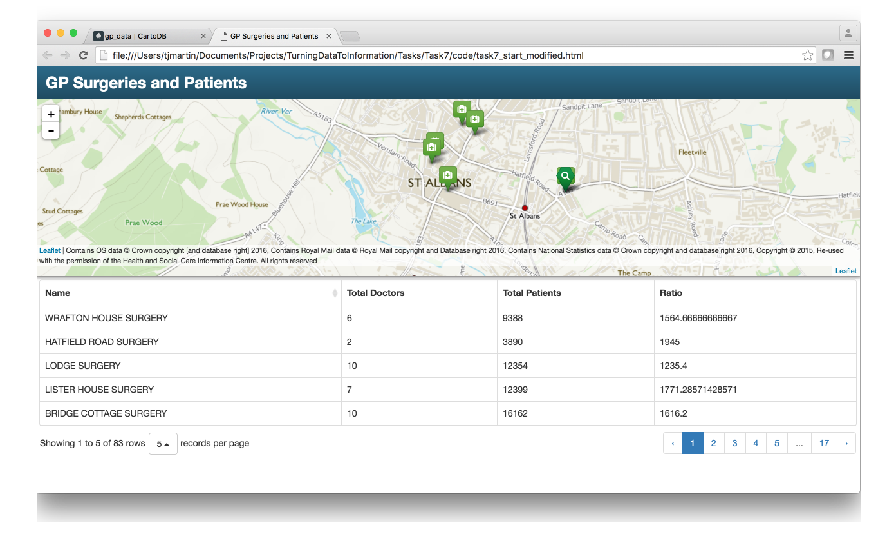
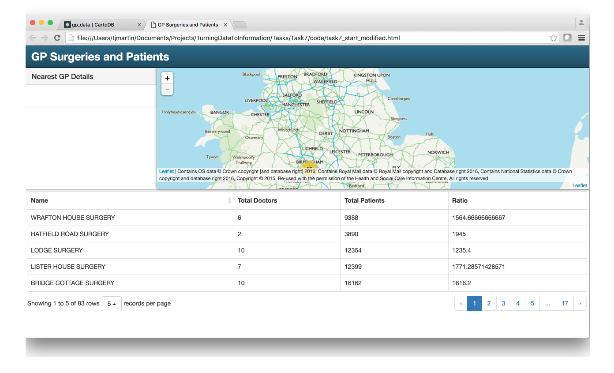
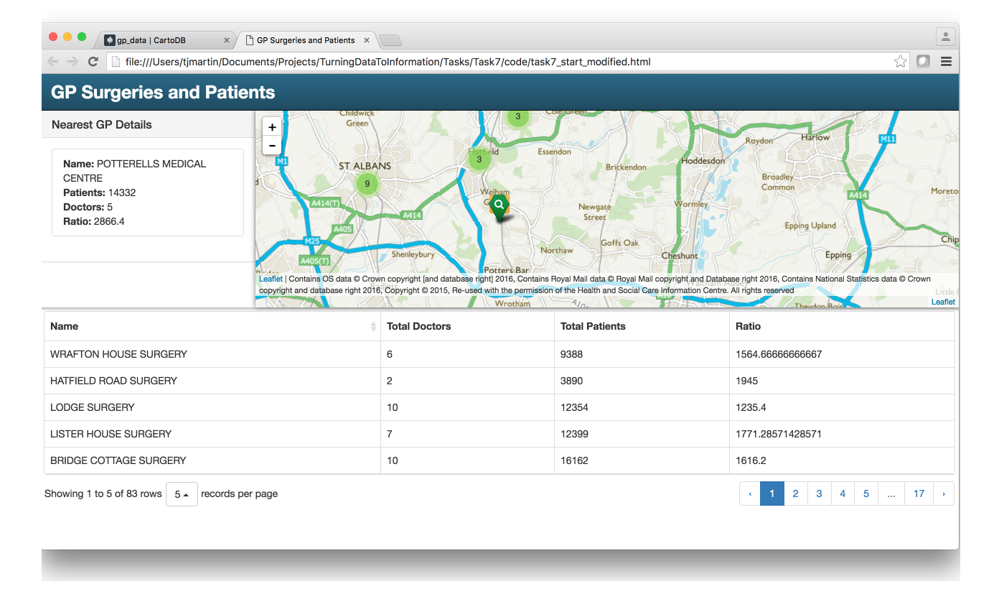
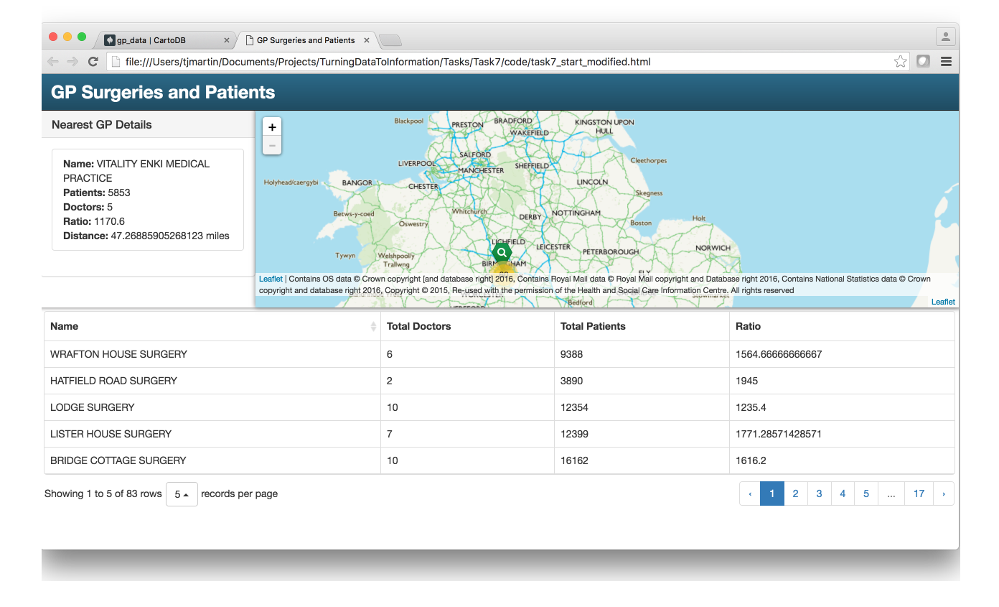
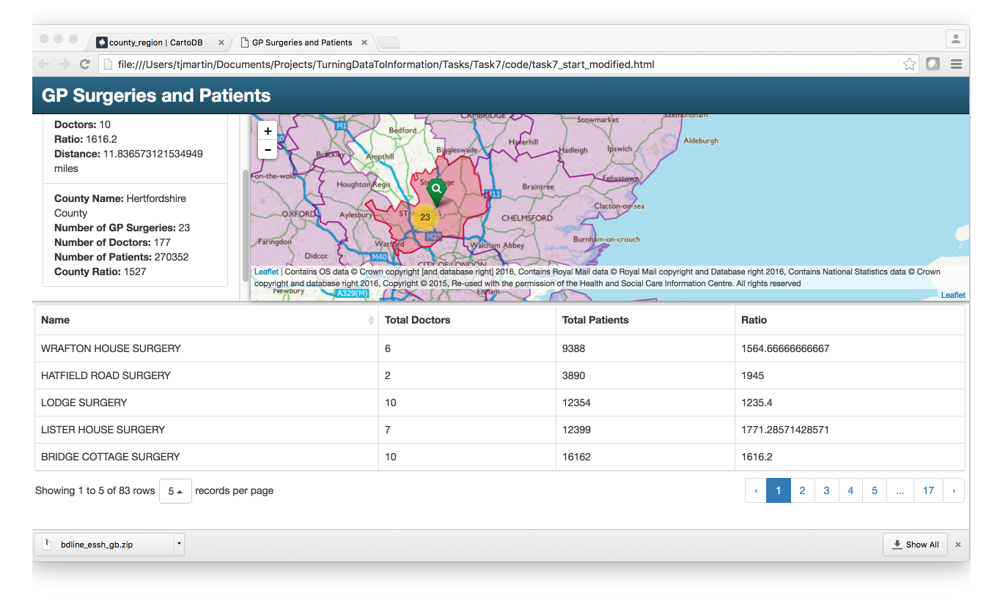
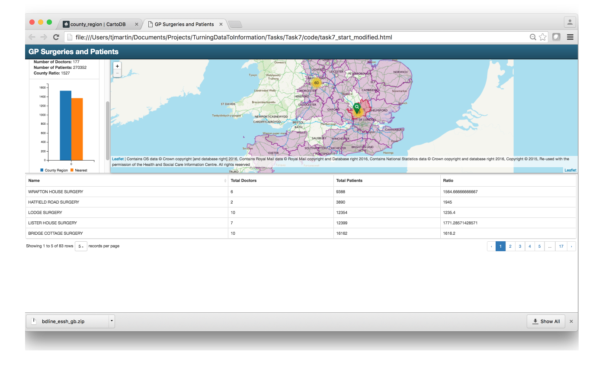

## Add Geospatial Analysis and Charts to our application

This task will walk you through how to add TurfJS to our application so that we can start to use some geoprocessing functions in our app.

### Steps
1. Show TurfJS examples and documentation
2. Add NEAREST to our app for a click event
3. Add a side bar to our app
4. On click event populate sidebar with nearest GP location
5. Add DISTANCE function and add that info to the sidebar
6. Load OS BoundaryLine County Region to CartoDB
7. Use COUNT to total up number of GPs in a county and their stats
8. Add a C3 chart to the sidebar to display results

#### Step 1

[TurfJS](http://turfjs.org/) is an open source javascript library for geospatial analysis for browsers. It has a number of traditional GIS functions like buffer and intersect, in addition with some statistics and joins which makes for a very powerful library to create an online GIS. One great example of the possibilities is [DropChop.io](http://dropchop.io/). One of the key things to note about Turf is that it uses GeoJSON for input and output.

Well that's handy seeing as we have GeoJSON from CartoDB, so lets get started.

#### Step 2

If you look at the Turf API docs on of the functions is [Nearest](http://turfjs.org/docs/#nearest) which in docs does the following:

```
Takes a reference point and a FeatureCollection of Features with Point geometries and returns the point from the FeatureCollection closest to the reference. This calculation is geodesic.
```

And it gives a nice simple example.

So we start by adding the library to our HTML. As before add this:

`<script src='https://api.tiles.mapbox.com/mapbox.js/plugins/turf/v2.0.2/turf.min.js'></script>`

So we can break down what we require into three seperate code blocks

1. The on map click event that fires when a user clicks on the map
2. A new GeoJSON layer to hold the nearest GP
3. A new marker style for the nearest point

We will begin with the easy stuff.

Add a new marker style to the bottom of our existing styles.

```javascript
var nearestMarker = L.ExtraMarkers.icon({
  icon: 'fa-search',
  markerColor: 'green',
  shape: 'penta',
  prefix: 'fa'
});
```

Next add a new GeoJSON layer underneath our gpLocations layer.

```javascript
// Nearest Feature layer will contain a single feature containing the nearest feature to searched or clicked location
var nearestFeature = L.geoJson(null, {
  pointToLayer: function (feature, latlng) {
    return L.marker(latlng, {icon: nearestMarker});
  },
  onEachFeature: function (feature, layer) {
    layer.bindPopup("<strong>Name:</strong> " + feature.properties.surgery_na);
  }
}).addTo(map);
```

Next we need to add the click event code beneath the attribution code.

```javascript
////////////////////////////////////////////////////////////////////////////////////////////
/////////////////////////////// Events /////////////////////////////////////////////////////

map.on('click', function(e) {
    nearestFeature.clearLayers();

    //Get the Lng/Lat from the on map click event and use Turf to turn it into a GeoJSON point
    var clickedPt = turf.point([e.latlng.lng, e.latlng.lat]);

    //Use Turf to buffer that clickedPt by a set distance
    var unit = 'miles';

    //Use Turf to find the nearest GP surgery
    var nearest = turf.nearest(clickedPt, markers.toGeoJSON());
    nearestFeature.addData(nearest);

});
```

Leaflet has number of events methods which can provide us with a number of different ways to interact with our application. These can be seen in the [documentation](http://leafletjs.com/reference.html) one of which is
is a 'click' event. So in our code block we use that to start the code to use Turf to find the nearest point based on the latlng of the click event on the map.

If you have added that code, save the HTML page and open it in your browser.



You can see in the image that there is a new search marker which represents the nearest GP to where I clicked on the map.

#### Step 3

To make our application more user friendly we will now add a sidebar to our application to hold information about the GP surgery.

Lets add the sidebar div and the sidebar class

```html
<div id="sidebar">
  <div class="panel panel-default">
    <div class="panel-heading">
      <h3 class="panel-title">Nearest GP Details</h3>
    </div>
    <div class="panel-body">
      <ul class="list-group">

      </ul>
    </div>
  </div>
</div>
```

```css
#sidebar {
  width: 300px;
  height: 45%;
  max-width: 100%;
  overflow-y: scroll;
  float: left;
  -webkit-transition: all 0.25s ease-out;
  -moz-transition: all 0.25s ease-out;
  transition: all 0.25s ease-out;
}
```

If you save the HTML and refresh the browser you should now see a sidebar.



#### Step 4

Next we will populate the sidebar with the details of nearest GP.

First we make sure the list group is empty by adding

`$(".list-group").empty();`

Underneath the code

`nearestFeature.clearLayers();`

Next add the following code underneath `nearestFeature.addData(nearest);`

```javascript
$(".list-group").append(
  '<li class="list-group-item"><strong>Name: </strong>' + nearest.properties.surgery_na + "</br>" +
  "<strong>Patients:</strong> " + nearest.properties.total_pati + "</br>" + "<strong>Doctors:</strong> " + nearest.properties.total_doct + '</br></li>');
```



#### Step 5

We will now use a second Turf function DISTANCE to calculate the distance from where we clicked to the nearest GP and add that to the sidebar details.

Add the following code to above the list-group

`var distance = turf.distance(clickedPt, nearest, unit);`

And then append the following code before the closing </li>

`'</br><strong>Distance: </strong>' + distance + ' miles'`

So you map.on event code should now look like this:

```javascript
map.on('click', function(e) {
    nearestFeature.clearLayers();

    $(".list-group").empty();

    //Get the Lng/Lat from the on map click event and use Turf to turn it into a GeoJSON point
    var clickedPt = turf.point([e.latlng.lng, e.latlng.lat]);

    //Use Turf to buffer that clickedPt by a set distance
    var unit = 'miles';

    //Use Turf to find the nearest GP surgery
    var nearest = turf.nearest(clickedPt, markers.toGeoJSON());
    nearestFeature.addData(nearest);

    var distance = turf.distance(clickedPt, nearest, unit);

    $(".list-group").append(
      '<li class="list-group-item"><strong>Name: </strong>' + nearest.properties.surgery_na + "</br>" +
      "<strong>Patients:</strong> " + nearest.properties.total_pati + "</br>" + "<strong>Doctors:</strong> " + nearest.properties.total_doct + '</br>' + "<strong>Ratio:</strong> " + nearest.properties.ratio + '</br><strong>Distance: </strong>' + distance + ' miles' + '</li>');

});
```

Save your HTML and refresh the browser.



We now have a distance add to the information.

#### Step 6

For this workshop I have already loaded OS Boundary-Line into my CartoDB account, if you are doing this at a different type then upload the ESRI Shapefile Boundary-Line county_region.shp to your own CartoDB account.

#### Step 7

In this Step we are going to use another Turf function, COUNT, in conjunction with the county_region layer to add up the stats for a county level so that a user could compare their nearest GP to the county level.

So there is quite a lot to do but we will break it into the following:

1. Add code to pull in county_region from CartoDB
2. Two new GeoJSON layers, one for county_region and the other for the clicked county
3. Add a click event for county region that runs the counting and displaying code


So we start by adding the following code to query the county_region from CartoDB.

```javascript
sql.execute("select ST_SimplifyPreserveTopology(the_geom, 0.01) as the_geom, name from county_region")
  .done(function(geojson) {
      county_region.addData(geojson);
      county_region.addTo(map);
  });
```

This uses a fantastic function within PostGIS, ST_SimplifyPreserveTopology, that simplifies the geometries of the features without compromising the quality of the data.

We then add the two new GeoJSON layers, this code should be very familiar by now.

```javascript
var county_region = L.geoJson(null, {
  style: {color: 'purple', weight: 2 }
}).addTo(map);

var click_region = L.geoJson(null, {
  style: {color: 'red', weight: 2 }
}).addTo(map);
```

Notice that we have given them a style within the layer definition rather than a separate code block for the styling.

Finally we need to add the code for the county region click event.

```javascript
county_region.on('click', function(e) {
  //First we clear the nearestFeature and click_region layers as we only want a single feature whenever a click is made.
  click_region.clearLayers();
  nearestFeature.clearLayers();

  //Next we get the event layer single polygon from the county region
  var single_region = e.layer.toGeoJSON();

  //Then add that to the click_region GeoJSON layer - this gives us the selected red polygon
  click_region.addData(single_region);

  //To use this polygon in Turf it needs to be a GeoJSON FeatureCollection
  var single_region_fc = {
    "type": "FeatureCollection",
    "features": [
      single_region
    ]
  };

  //Next we use Turf function WITHIN to get all the GP surgeries that are within that single polygon
  var ptsWithin = turf.within(surgeries, single_region_fc);

  //We can then use the Turf function COUNT to total up the number of surgeries in the single polygon
  var counted = turf.count(single_region_fc, surgeries, 'pt_count');

  var totalDoctors = 0;
  var totalPatients = 0;

  //This code loops through the points that are within the single polygon and totals all doctors and all patients
  for (var i = 0; i < ptsWithin.features.length; i++) {
      totalDoctors = totalDoctors + ptsWithin.features[i].properties.total_doct;
      totalPatients = totalPatients + ptsWithin.features[i].properties.total_pati;
  }

  //This is the county region ratio
  var county_ratio = totalPatients/totalDoctors;

  //Below is the code we already use for the map on click event, but it needs to be duplicated here as the user could click on a county region or an area of the map where there is no county.
  var clickedPt = turf.point([e.latlng.lng, e.latlng.lat]);

  var unit = 'miles';

  var nearest = turf.nearest(clickedPt, markers.toGeoJSON());
  nearestFeature.addData(nearest);

  var distance = turf.distance(clickedPt, nearest, unit);

  $(".list-group").empty();

  $(".list-group").append(
    '<li class="list-group-item"><strong>Name: </strong>' + nearest.properties.surgery_na + "</br>" +
    "<strong>Patients:</strong> " + nearest.properties.total_pati + "</br>" + "<strong>Doctors:</strong> " + nearest.properties.total_doct + '</br>' + "<strong>Ratio:</strong> " + nearest.properties.ratio + '</br><strong>Distance: </strong>' + distance + ' miles' + '</li>');


  $(".list-group").append(
    '<li class="list-group-item"><strong>County Name: </strong>' + counted.features[0].properties.name + "</br>" +
    '<strong>Number of GP Surgeries: </strong>' + counted.features[0].properties.pt_count + "</br>" +
    '<strong>Number of Doctors: </strong>' + totalDoctors + "</br>" +
    '<strong>Number of Patients: </strong>' + totalPatients + "</br>" +
    '<strong>County Ratio: </strong>' + Math.round(county_ratio) + "</br>" +
    '<div id="chart"></div>' +
    '</li>');

  });
```

That is a lot of code so I have included some inline comments to help explain what is happening and why



Notice we still have our nearest surgery working as well as by county.

#### Step 8

Finally we will add a chart to the sidebar to show that you can also push the data to a chart.

[C3](http://c3js.org/) is a javascript chart library that is built upon the really exciting, but complex, [D3](https://d3js.org/) library. It will allow us to add a simple bar chart to our application with just a few lines of code.

To get this to work we need to start by adding both C3 and D3 libraries to your application. We will use the following CDN links for that.

```
https://cdnjs.cloudflare.com/ajax/libs/d3/3.5.17/d3.js
https://cdnjs.cloudflare.com/ajax/libs/c3/0.4.11/c3.min.css
https://cdnjs.cloudflare.com/ajax/libs/c3/0.4.11/c3.min.js
```

Next add the following code block at the bottom of the county_Region click event

```javascript
$(".list-group").append('<li class="list-group-item"><div id="chart"></div></li>');

  var chart = c3.generate({
      data: {
          columns: [
              ['County Region', county_ratio],
              ['Nearest', nearest.properties.ratio]
          ],
          type: 'bar'
      },
      bar: {
          width: {
              ratio: 0.5
          }
      }
  });
```

This code adds a new list group item which contains a div for the chart (id="chart") and then uses c3 to generate a bar chart using the county region ratio and the nearest ratio as the data.



Well done its looking great and that concludes Task 7
